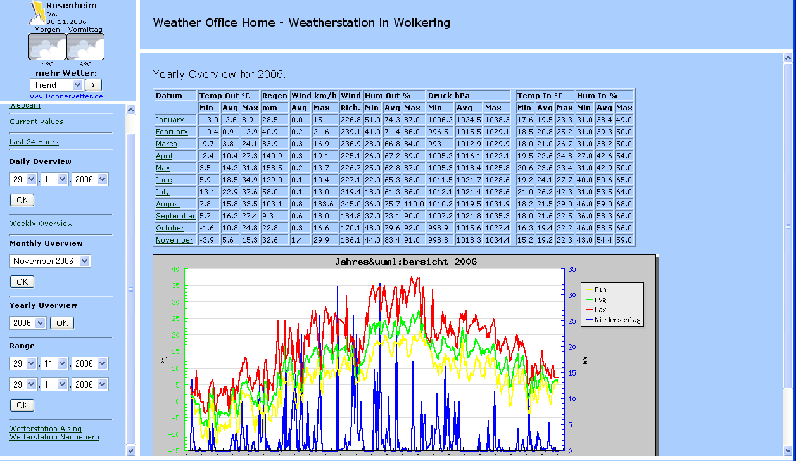
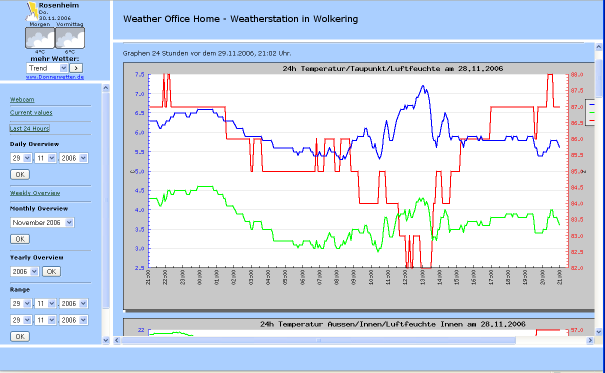
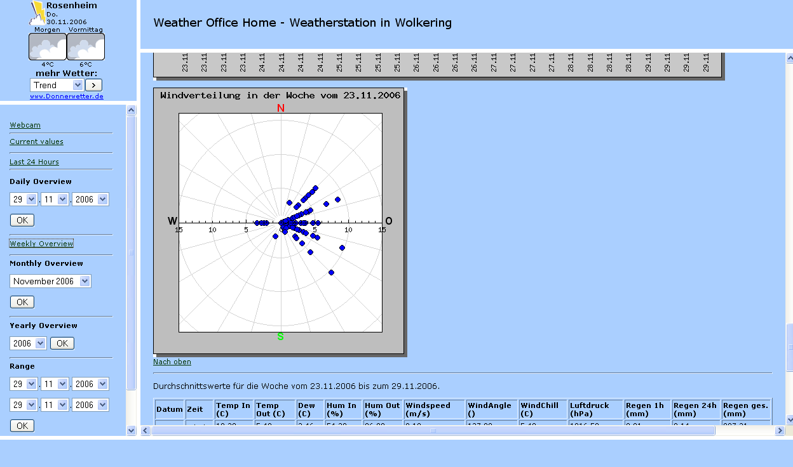
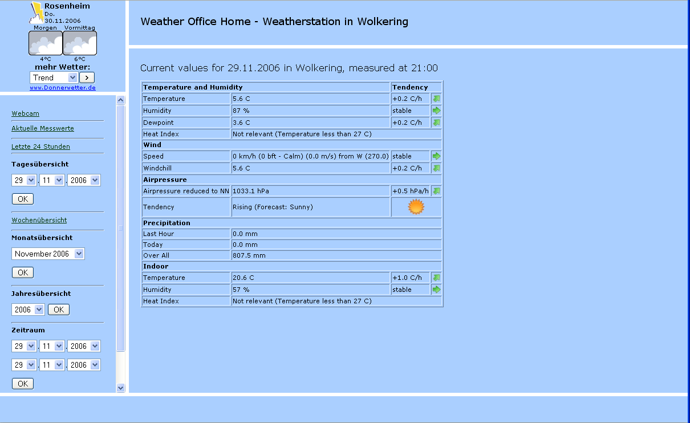

# WeatherOffice

Fork from  https://sourceforge.net/p/weatheroffice/

Weather Office is a PHP frontend for the database created by open2300 for the WS2300 Weather station ("Matrix"). For a demonstration visit http://wetter.homeunix.net

## Project Samples

